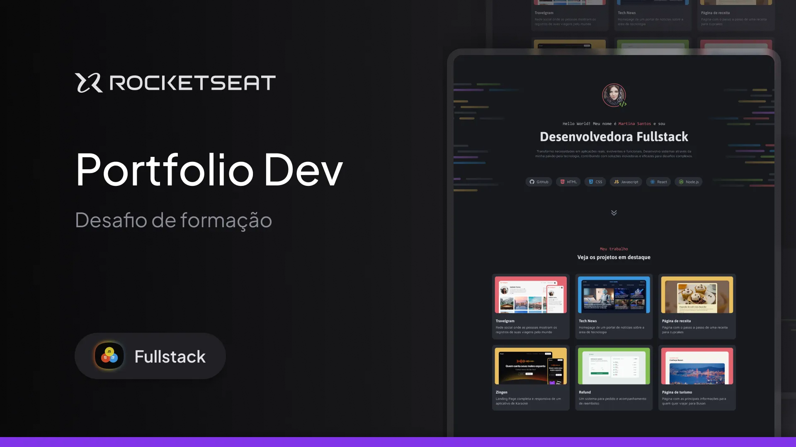

<h1 align="center">Portifólio</h1>

Página codada como um desafio, parte da formação Fullstack da Rocketseat, com a intenção de reunir e apresentar alguns dos trabalhos desenvolvidos ao longo do curso, entre eles HTML, CSS, JavaScript, TypeScript, Node.js, React, entre outros.

No projeto desta página específica os seguintes conceitos foram aplicados:

- Criação de layouts com CSS;
- Posicionamento de elementos;
- CSS Flexbox;
- CSS Grid;
- Variáveis CSS;
- pseudo-class e pseudo-elements.

  <a href="#-tecnologias">Tecnologias</a>&nbsp;&nbsp;&nbsp;|&nbsp;&nbsp;&nbsp;
  <a href="#-projeto">Projeto</a>&nbsp;&nbsp;&nbsp;|&nbsp;&nbsp;&nbsp;

  

 

  

## 🚀 Tecnologias

Este projeto foi desenvolvido com as seguintes tecnologias:

- HTML e CSS  
- Git e GitHub  
- Figma

## 💻 Projeto

O projeto apresenta o portifólio constituído por algum dos projetos desenvolvidos durante o curso Fullstack da Rocketseat.

- [Acesse o projeto finalizado online](dev-filipebcs.github.io/Portfolio/)
